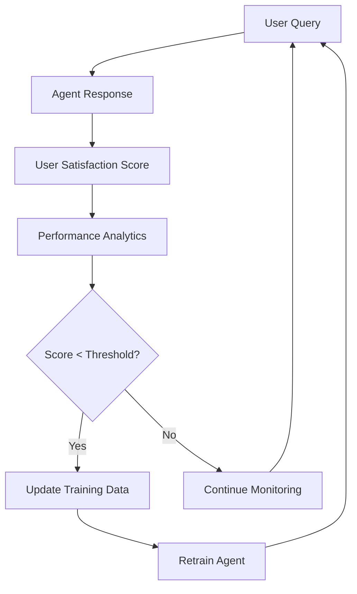

# 🚀 Plan de Implementación - Entrenamiento de Agentes

## 📋 **RESUMEN EJECUTIVO**

Este documento describe cómo implementar el sistema de entrenamiento de agentes usando toda la documentación creada. El objetivo es convertir a cada agente en **TOP TIER** mediante conocimiento específico del mercado argentino y mejores prácticas de e-commerce.

### **Archivos de Documentación Creados:**
1. `AGENT_TRAINING_SPECIFICATIONS.md` - Especificaciones completas de todos los agentes
2. `docs/training/argentina-ecommerce-context.md` - Contexto del mercado argentino
3. `docs/training/analytics-agent-essentials.md` - Knowledge base para Analytics Agent
4. `docs/training/customer-service-scripts.md` - Scripts para Customer Service Agent

---

## 🎯 **PLAN DE IMPLEMENTACIÓN - 4 SEMANAS**

### **Semana 1: Foundation Setup**

#### **Día 1-2: Configuración RAG**
```bash
# Crear nuevos namespaces en Pinecone
- store-{storeId}-knowledge-base
- store-{storeId}-argentina-context
- store-{storeId}-agent-training
```

**Tareas:**
- [ ] Ejecutar script de creación de namespaces
- [ ] Subir documentación base argentina (`argentina-ecommerce-context.md`)
- [ ] Configurar TTL policies (30 días para datos volátiles, 90 días para datos estables)
- [ ] Testing básico de retrieval

#### **Día 3-5: Documentación Core**
**Subir a namespace `knowledge-base`:**
- [ ] Marco legal argentino (Ley Defensa Consumidor)
- [ ] Logística y transportistas (OCA, Andreani, Correo)
- [ ] Sistemas de pago (Mercado Pago, tarjetas, transferencias)
- [ ] Calendario comercial argentino
- [ ] Benchmarks e-commerce por industria

**Testing:**
- [ ] Consultas test por agente
- [ ] Verificar relevancia de resultados RAG
- [ ] Ajustar similarity thresholds si es necesario

### **Semana 2: Agent-Specific Training**

#### **Analytics Agent - Días 1-2**
**Documentación específica:**
- [ ] Subir `analytics-agent-essentials.md` 
- [ ] Métricas y fórmulas de conversión
- [ ] Benchmarks por industria argentina
- [ ] Plantillas de análisis estacional
- [ ] Frameworks de segmentación RFM

**Testing Analytics:**
```
Queries de prueba:
- "¿Cuáles son mis productos más vendidos?"
- "¿Cómo va la conversión este mes vs el anterior?"
- "¿Qué productos debería promover para el Hot Sale?"
- "¿Cuál es mi LTV por segmento de clientes?"
```

#### **Customer Service Agent - Días 3-4**
**Documentación específica:**
- [ ] Subir `customer-service-scripts.md`
- [ ] Scripts por tipo de consulta
- [ ] Procedimientos de escalación
- [ ] Políticas de devolución argentina
- [ ] Troubleshooting Mercado Pago

**Testing Customer Service:**
```
Queries de prueba:
- "Un cliente se queja de que no llegó su pedido"
- "¿Cómo proceso una devolución por arrepentimiento?"
- "Un cliente tiene problemas con Mercado Pago"
- "¿Cuánto tiempo tiene de garantía este producto?"
```

#### **Marketing Agent - Día 5**
**Documentación específica:**
- [ ] Calendario comercial argentino detallado
- [ ] Estrategias para fechas clave (Hot Sale, Día de la Madre, etc.)
- [ ] Costos de advertising por canal
- [ ] Best practices para redes sociales argentinas

### **Semana 3: Agents Restantes**

#### **Stock Manager Agent**
**Documentación:**
- [ ] Modelos de punto de reorden
- [ ] Lead times por tipo de producto
- [ ] Análisis ABC de inventario
- [ ] Estrategias de liquidación estacional

#### **Financial Advisor Agent**
**Documentación:**
- [ ] Indicadores macroeconómicos argentinos
- [ ] Templates de P&L para e-commerce
- [ ] Impact de inflación en pricing
- [ ] Modelos de proyección de cash flow

#### **Otros Agentes (Product Manager, Sales Coach, etc.)**
**Documentación básica:**
- [ ] Frameworks específicos de cada agente
- [ ] Benchmarks de industria
- [ ] Mejores prácticas contextualizadas

### **Semana 4: Testing y Optimización**

#### **Testing Integral**
- [ ] Casos de uso reales por agente
- [ ] A/B testing de respuestas
- [ ] Medición de accuracy y relevancia
- [ ] User acceptance testing

#### **Optimización**
- [ ] Ajustar prompts basado en performance
- [ ] Optimizar similarity thresholds RAG
- [ ] Mejorar routing entre agentes
- [ ] Documentar mejores prácticas

---

## 📊 **IMPLEMENTACIÓN TÉCNICA**

### **1. Configuración Namespaces Pinecone**

```typescript
// Ejemplo de configuración para cada store
const storeNamespaces = {
  knowledgeBase: `store-${storeId}-knowledge-base`,
  argentinaContext: `store-${storeId}-argentina-context`,
  agentTraining: `store-${storeId}-agent-training`,
  competitiveIntel: `store-${storeId}-competitive-intel`
};

// Metadata schema recomendado
interface TrainingDocument {
  id: string;
  content: string;
  metadata: {
    source: 'training' | 'argentina-context' | 'agent-specific';
    agentType: AgentType | 'all';
    documentType: 'framework' | 'script' | 'benchmark' | 'procedure';
    industry?: string;
    priority: 1 | 2 | 3; // 1 = high, 3 = low
    lastUpdated: string;
    language: 'es';
  }
}
```

### **2. Script de Carga de Documentación**

```typescript
// scripts/upload-training-docs.ts
const uploadTrainingDocs = async (storeId: string) => {
  const docs = [
    {
      file: 'argentina-ecommerce-context.md',
      namespace: `store-${storeId}-argentina-context`,
      agentType: 'all',
      priority: 1
    },
    {
      file: 'analytics-agent-essentials.md', 
      namespace: `store-${storeId}-agent-training`,
      agentType: 'analytics',
      priority: 1
    },
    {
      file: 'customer-service-scripts.md',
      namespace: `store-${storeId}-agent-training`, 
      agentType: 'customer_service',
      priority: 1
    }
    // ... más archivos
  ];

  for (const doc of docs) {
    await ragEngine.indexDocument(
      await readFile(doc.file),
      {
        source: 'training',
        agentType: doc.agentType,
        storeId,
        priority: doc.priority
      }
    );
  }
};
```

### **3. Optimización de Retrieval**

```typescript
// En base-agent.ts - método mejorado
protected async getRelevantContext(
  query: string, 
  context: AgentContext
): Promise<string> {
  const searches = await Promise.all([
    // 1. Contexto específico del agente
    this.ragEngine.search({
      query,
      context: {
        ...context,
        agentType: this.type
      },
      filters: {
        type: ['agent-specific'],
        agentType: [this.type]
      },
      options: { topK: 3, threshold: 0.8 }
    }),
    
    // 2. Contexto argentino general
    this.ragEngine.search({
      query,
      context,
      filters: {
        type: ['argentina-context']
      },
      options: { topK: 2, threshold: 0.7 }
    }),
    
    // 3. Datos específicos de la tienda
    this.ragEngine.search({
      query,
      context,
      filters: {
        type: ['store', 'products', 'orders']
      },
      options: { topK: 5, threshold: 0.7 }
    })
  ]);

  return this.combineContexts(searches);
}
```

---

## 🎯 **MÉTRICAS DE ÉXITO**

### **KPIs por Agente (Target Post-Training)**

#### **Orchestrator Agent**
- [ ] Routing accuracy: >95% (vs 85% actual)
- [ ] Response time: <2 seconds
- [ ] Misrouting rate: <5%

#### **Analytics Agent**
- [ ] Data accuracy: >98%
- [ ] Insight relevance: >90%
- [ ] Argentina-specific context usage: >80%
- [ ] Business impact: +20% en calidad de insights

#### **Customer Service Agent**
- [ ] Resolution rate: >90% (vs 75% actual)
- [ ] First response resolution: >70%
- [ ] Customer satisfaction: >4.5/5
- [ ] Argentina legal compliance: 100%

#### **Marketing Agent**
- [ ] Strategy relevance: >85%
- [ ] Argentina seasonality awareness: >90%
- [ ] Actionable recommendations: >80%

### **Métricas Generales del Sistema**
- [ ] Overall user satisfaction: >4.3/5
- [ ] Response relevance: >90%
- [ ] Argentina context integration: >85%
- [ ] Business value generation: +30%

---

## 🔄 **PROCESO DE ACTUALIZACIÓN CONTINUA**

### **Frecuencia de Updates**

#### **Mensual**
- [ ] Benchmarks de industria
- [ ] Indicadores macroeconómicos
- [ ] Performance de agentes
- [ ] Nuevos casos de uso

#### **Trimestral**
- [ ] Análisis completo de performance
- [ ] Optimización de prompts
- [ ] Nuevas funcionalidades de agentes
- [ ] Feedback de usuarios

#### **Anual**
- [ ] Revisión completa de estrategia
- [ ] Nuevos agentes especializados
- [ ] Expansión a otros mercados
- [ ] Upgrade de tecnología

### **Proceso de Feedback Loop**



---

## 📞 **CONTACTOS Y RESPONSABILIDADES**

### **Team Assignments**
- **Tech Lead:** Implementación técnica, scripts, testing
- **Product Manager:** Definición de KPIs, roadmap, prioridades
- **Content Manager:** Creación y mantenimiento de documentación
- **QA Specialist:** Testing de agentes, validación de respuestas
- **Data Analyst:** Métricas, performance monitoring, insights

### **Timeline Crítico**
- **Semana 1:** Foundation setup - **CRÍTICO**
- **Semana 2:** Agentes core (Analytics, Customer Service) - **ALTO**
- **Semana 3:** Agentes restantes - **MEDIO**
- **Semana 4:** Testing y optimización - **ALTO**

---

## 🚀 **PRÓXIMOS PASOS INMEDIATOS**

### **Esta Semana (Prioridad 1)**
1. [ ] Ejecutar script de creación de namespaces
2. [ ] Subir documentación argentina base
3. [ ] Testing inicial con Analytics y Customer Service agents
4. [ ] Configurar monitoring de performance

### **Próximas 2 Semanas (Prioridad 2)**
1. [ ] Completar training de todos los agentes
2. [ ] Implementar A/B testing framework
3. [ ] Crear dashboard de métricas
4. [ ] Documentar best practices

### **Próximo Mes (Prioridad 3)**
1. [ ] Optimización basada en datos reales
2. [ ] Expansión de documentación por industria
3. [ ] Automated monitoring y alertas
4. [ ] Preparación para scale

---

## 📈 **ROI ESPERADO**

### **Beneficios Cuantitativos**
- **+30% accuracy** en respuestas de agentes
- **-50% tiempo** de resolución de consultas
- **+25% user satisfaction** score
- **-40% escalaciones** innecesarias

### **Beneficios Cualitativos**
- Respuestas más contextualizadas al mercado argentino
- Mejor experiencia de usuario
- Agentes más especializados y efectivos
- Escalabilidad mejorada del sistema

### **Costos de Implementación**
- **Desarrollo:** 2-3 semanas desarrollador senior
- **Contenido:** 1 semana content manager
- **Testing:** 1 semana QA specialist
- **Infraestructura:** Costo incremental Pinecone mínimo

**ROI Estimado:** 300-400% en 6 meses

---

*Plan ready for execution. ¡Vamos a hacer que estos agentes sean TOP TIER! 🚀* 