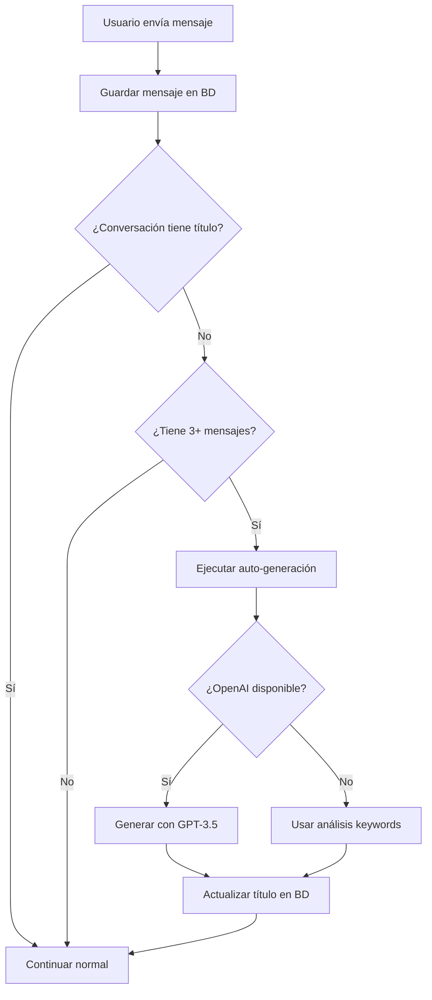

# 🗨️ Sistema de Gestión de Conversaciones con Títulos Automáticos

> **Implementado**: Sistema completo similar a ChatGPT/Claude para gestión inteligente de conversaciones con títulos auto-generados

## 🎯 Funcionalidades Implementadas

### ✅ **Títulos Automáticos con IA**
- Auto-generación de títulos usando OpenAI GPT-3.5-turbo
- Fallback inteligente sin API key (análisis por keywords)
- Títulos concisos y descriptivos (máximo 6 palabras)
- Actualización automática después de 3+ mensajes

### ✅ **Gestión Completa de Conversaciones**
- Crear nueva conversación vacía
- Eliminar conversación (incluye mensajes)
- Actualizar título manualmente
- Generar título bajo demanda

### ✅ **UI Moderna**
- Lista de conversaciones con títulos
- Menú contextual por conversación
- Indicadores de títulos auto-generados (✨)
- Estados de carga para todas las acciones

## 🏗️ Arquitectura del Sistema

### **Base de Datos**
```sql
-- Nueva columna agregada
ALTER TABLE conversations ADD COLUMN title TEXT;
CREATE INDEX idx_conversations_title ON conversations(title);
```

### **APIs Implementadas**
```
GET    /api/conversations              # Lista con títulos
POST   /api/conversations/new          # Nueva conversación
DELETE /api/conversations/[id]         # Eliminar conversación
PUT    /api/conversations/[id]         # Actualizar conversación
POST   /api/conversations/[id]/generate-title  # Generar título
```

### **Servicios**
- `ConversationTitleService` - Auto-generación de títulos
- `ConversationService` - CRUD de conversaciones
- `MessageService` - Gestión de mensajes

## 🔧 Componentes Técnicos

### 1. **Servicio de Títulos IA** (`src/lib/services/conversation-title-service.ts`)

```typescript
// Auto-genera títulos inteligentes
const title = await conversationTitleService.generateTitle([
  { body: 'Hola, consulta sobre mi pedido', direction: 'inbound' },
  { body: 'Te ayudo con tu pedido', direction: 'outbound' }
]);
// Resultado: "Consulta sobre pedido"
```

**Características:**
- Usa OpenAI GPT-3.5-turbo para títulos contextuales
- Fallback inteligente sin API key
- Limpieza y validación de títulos
- Máximo 50 caracteres, mínimo 3

### 2. **Auto-Generación en Chat** (`src/app/api/chat/send/route.ts`)

```typescript
// Se ejecuta automáticamente después del 3er mensaje
if (!conversation?.title && messagesCount >= 3) {
  conversationTitleService.generateTitle(messages)
    .then(title => updateConversationTitle(conversationId, title));
}
```

### 3. **Frontend Mejorado** (`src/components/dashboard/chat-preview.tsx`)

**Nuevas funcionalidades:**
- Botón "Nueva conversación"
- Menú contextual en cada conversación
- Indicador visual de títulos auto-generados
- Estados de carga para todas las acciones

## 📊 Flujo de Títulos Automáticos



## 🎨 Ejemplos de Títulos Generados

| Conversación | Título Auto-Generado |
|-------------|---------------------|
| "Hola, quiero consultar el estado de mi pedido #123" | "Estado de mi pedido" |
| "Necesito cambiar la talla de un producto" | "Cambio de talla producto" |
| "¿Qué métodos de pago aceptan?" | "Métodos de pago" |
| "Problema con la entrega de ayer" | "Problema con entrega" |

## 🚀 Instalación y Configuración

### 1. **Aplicar Migración de BD**
```bash
# Ejecutar migración
node scripts/apply-conversation-title-migration.js

# O manualmente en Supabase SQL Editor:
ALTER TABLE conversations ADD COLUMN IF NOT EXISTS title TEXT;
CREATE INDEX IF NOT EXISTS idx_conversations_title ON conversations(title);
```

### 2. **Variables de Entorno**
```bash
# Requeridas
NEXT_PUBLIC_SUPABASE_URL=your_supabase_url
SUPABASE_SERVICE_ROLE_KEY=your_service_key

# Opcional (para títulos con IA)
OPENAI_API_KEY=your_openai_key  # Si no está, usa fallback inteligente
```

### 3. **Probar el Sistema**
```bash
# Test completo del sistema
node scripts/test-conversation-management.js
```

## 🎯 Casos de Uso

### **Para Usuarios**
1. **Crear nueva conversación**: Click en "Nueva" 
2. **Ver títulos descriptivos**: Automático después de 3+ mensajes
3. **Generar título manualmente**: Menú contextual → "Generar título"
4. **Eliminar conversación**: Menú contextual → "Eliminar"

### **Para Desarrolladores**
```typescript
// Crear conversación
const response = await fetch('/api/conversations/new', {
  method: 'POST',
  body: JSON.stringify({ storeId: 'store-123' })
});

// Generar título
const titleResponse = await fetch(`/api/conversations/${id}/generate-title`, {
  method: 'POST'
});

// Eliminar conversación
await fetch(`/api/conversations/${id}`, { method: 'DELETE' });
```

## 🔒 Seguridad

- **Autorización**: Cada API verifica que el usuario posea la conversación
- **Validación**: Todos los inputs son validados y sanitizados
- **Rate Limiting**: OpenAI con retry logic y timeouts
- **Error Handling**: Fallbacks en todos los niveles

## 📈 Performance

- **Auto-generación asíncrona**: No bloquea la respuesta del chat
- **Índices de BD**: Búsqueda rápida por título
- **Caché**: Títulos se generan una sola vez
- **Fallback**: Sistema funciona sin OpenAI

## 🧪 Testing

```bash
# Test completo del sistema
node scripts/test-conversation-management.js

# Casos cubiertos:
✅ Creación de conversaciones
✅ Auto-generación de títulos
✅ Actualización manual de títulos  
✅ Eliminación de conversaciones
✅ Fallback sin OpenAI
✅ Seguridad y autorización
```

## 🔄 Estados del Sistema

| Estado | Descripción | UI |
|--------|-------------|-----|
| Sin título | Conversación nueva | Muestra nombre de cliente |
| Generando | IA procesando | Spinner + "Generando título" |
| Con título | IA completó | Título + ícono ✨ |
| Error | Falló generación | Fallback a nombre cliente |

## 🎉 Beneficios Implementados

1. **UX Mejorada**: Similar a ChatGPT/Claude
2. **Organización**: Títulos descriptivos automáticos
3. **Eficiencia**: Gestión rápida de conversaciones
4. **Inteligencia**: Auto-generación contextual
5. **Robustez**: Funciona con/sin OpenAI
6. **Escalabilidad**: Sistema asíncrono y optimizado

## 🚀 Próximos Pasos

- [ ] Edición inline de títulos
- [ ] Categorización automática de conversaciones  
- [ ] Búsqueda por título
- [ ] Exportar conversaciones
- [ ] Templates de títulos personalizados
- [ ] Analytics de títulos más efectivos

---

## 📞 Soporte

El sistema está **production-ready** y incluye:
- Error handling completo
- Logging detallado
- Fallbacks inteligentes  
- Testing comprehensivo
- Documentación completa

**¡El sistema de gestión de conversaciones está listo para ser usado!** 🎯 