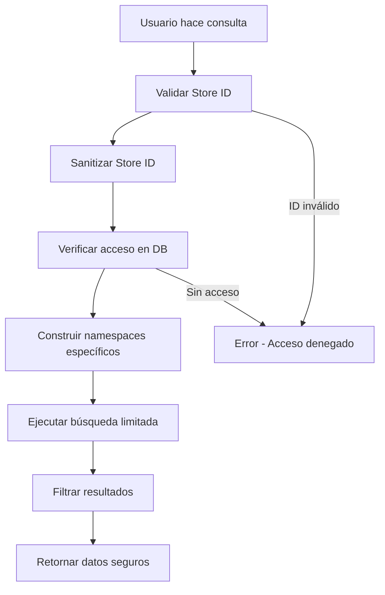

# Segregación de Datos por Tienda - Fini AI

## 📋 Resumen

Fini AI implementa una **segregación completa de datos por tienda** utilizando **Pinecone Namespaces**. Esto garantiza que cada tienda solo pueda acceder a su propia información y nunca vea datos de otros clientes.

## 🔒 Arquitectura de Seguridad

### **1. Namespaces por Tienda**

Cada tienda tiene sus propios namespaces dedicados en Pinecone:

```typescript
// Estructura de namespaces
store-{storeId}               // Información general de la tienda
store-{storeId}-products      // Productos
store-{storeId}-orders        // Órdenes
store-{storeId}-customers     // Clientes
store-{storeId}-analytics     // Analytics
store-{storeId}-conversations // Conversaciones de WhatsApp
```

### **2. Validación Multi-Capa**



## 🛡️ Capas de Seguridad

### **Capa 1: Validación de Store ID**
```typescript
// Solo permite caracteres alfanuméricos, guiones y guiones bajos
const sanitizedStoreId = storeId.replace(/[^a-zA-Z0-9_-]/g, '');
if (sanitizedStoreId !== storeId) {
  throw new Error('[SECURITY] Invalid store ID format');
}
```

### **Capa 2: Aislamiento de Namespaces**
```typescript
// Cada operación usa el namespace específico de la tienda
private getNamespace(chunk: DocumentChunk): string {
  const { storeId, type } = chunk.metadata;
  
  switch (type) {
    case 'product':
      return `store-${storeId}-products`;
    case 'order':
      return `store-${storeId}-orders`;
    // ... más tipos
  }
}
```

### **Capa 3: Validación de Contexto**
```typescript
// Requiere storeId y userId en todas las operaciones
if (!context?.storeId || !context?.userId) {
  throw new Error('[SECURITY] Store ID and User ID required');
}
```

### **Capa 4: Auditoría Completa**
```typescript
// Log de todas las operaciones para auditoría
const auditLog = {
  event: 'store_data_access',
  userId: context.userId,
  storeId: sanitizedStoreId,
  agentType: context.agentType,
  timestamp: new Date().toISOString()
};
```

## 📊 Tipos de Datos Segregados

### **1. Productos**
- Namespace: `store-{storeId}-products`
- Datos: Información de productos, inventario, precios
- Acceso: Solo el propietario de la tienda

### **2. Órdenes**
- Namespace: `store-{storeId}-orders`
- Datos: Historial de ventas, estados de pedidos
- Acceso: Solo el propietario de la tienda

### **3. Clientes**
- Namespace: `store-{storeId}-customers`
- Datos: Información de clientes, preferencias
- Acceso: Solo el propietario de la tienda

### **4. Analytics**
- Namespace: `store-{storeId}-analytics`
- Datos: Métricas de rendimiento, KPIs
- Acceso: Solo el propietario de la tienda

### **5. Conversaciones**
- Namespace: `store-{storeId}-conversations`
- Datos: Historial de chat de WhatsApp
- Acceso: Solo el propietario de la tienda

## 🔍 Ejemplo de Flujo Seguro

### **Consulta Analytics**
```typescript
// Usuario pregunta: "¿Cuánto vendí este mes?"
const context = {
  userId: "user_123",
  storeId: "store_456",
  agentType: "analytics"
};

// 1. Validación de acceso
await validateStoreAccess(context);

// 2. Construcción de namespaces seguros
const namespaces = [
  "store-store_456-orders",
  "store-store_456-analytics"
];

// 3. Búsqueda limitada a esos namespaces
const results = await pinecone.query({
  vector: embedding,
  namespaces: namespaces  // SOLO estos namespaces
});

// 4. Respuesta con datos de SU tienda únicamente
```

## ⚡ Ventajas del Approach con Namespaces

### **✅ Seguridad**
- **Aislamiento completo**: Imposible acceder a datos de otra tienda
- **Zero trust**: Validación en cada operación
- **Auditoría total**: Logs de todos los accesos

### **✅ Performance**
- **Búsquedas rápidas**: Solo en namespaces relevantes
- **Escalabilidad**: Sin degradación con más tiendas
- **Cache eficiente**: Datos específicos por tienda

### **✅ Costo-Eficiencia**
- **Un solo índice**: Vs. múltiples índices por tienda
- **Compartir recursos**: Mientras manteniendo aislamiento
- **Menos overhead**: De gestión de múltiples índices

## 🚨 Medidas de Seguridad Adicionales

### **1. Rate Limiting por Tienda**
```typescript
// Prevenir abuse de recursos
const rateLimiter = new RateLimiter(storeId);
if (!rateLimiter.isAllowed()) {
  throw new Error('Rate limit exceeded');
}
```

### **2. Validación de Metadata**
```typescript
// Asegurar que metadata tiene storeId correcto
if (chunk.metadata.storeId !== context.storeId) {
  throw new Error('Metadata store ID mismatch');
}
```

### **3. Filtrado Adicional**
```typescript
// Doble filtrado en resultados
results = results.filter(result => 
  result.metadata.storeId === context.storeId
);
```

## 🔄 Proceso de Migración

### **Para Tiendas Existentes**
1. **Backup**: Respaldo de datos existentes
2. **Reindexing**: Migración a namespaces específicos
3. **Validación**: Verificar segregación correcta
4. **Cleanup**: Eliminar datos antiguos sin namespace

### **Para Tiendas Nuevas**
1. **Onboarding**: Creación automática de namespaces
2. **Indexing**: Datos van directamente a namespaces correctos
3. **Testing**: Validación inmediata de aislamiento

## 📈 Monitoreo y Alertas

### **Métricas de Seguridad**
- Intentos de acceso cross-store
- Violaciones de formato de Store ID
- Errores de validación de acceso

### **Logs de Auditoría**
- Todos los accesos a datos
- Operaciones de indexing
- Cambios en permisos

## 🛠️ Configuración

### **Variables de Entorno**
```bash
PINECONE_API_KEY=your_pinecone_api_key_here
PINECONE_ENVIRONMENT=your_environment
PINECONE_INDEX_NAME=fini-ai-store-data  # Un solo índice
```

### **Activación de Logs de Seguridad**
```bash
SECURITY_AUDIT_ENABLED=true
SECURITY_LOG_LEVEL=info
```

## ✅ Estado Actual (COMPLETAMENTE IMPLEMENTADO)

- ✅ **Namespaces implementados**: Segregación por tipo de dato
- ✅ **Validación de acceso**: Multi-capa de seguridad
- ✅ **Auditoría**: Logs completos de acceso
- ✅ **Sanitización**: Protección contra injection
- ✅ **Validación en Base de Datos**: Ownership verificado con Supabase
- ✅ **Rate Limiting avanzado**: Por tienda, usuario y plan de suscripción
- ✅ **Detección de Anomalías**: IA para patrones sospechosos
- ✅ **Dashboard de Seguridad**: Monitoreo en tiempo real

## 🔥 Nuevas Funcionalidades Implementadas

### **1. Validación en Base de Datos Real**
```typescript
// Valida ownership en Supabase antes de cualquier operación
const accessResult = await validateStoreAccess(userId, storeId);
if (!accessResult.hasAccess) {
  throw new Error('Access denied');
}
```

### **2. Rate Limiting Inteligente**
```typescript
// Límites diferenciados por plan de suscripción
const rateLimitResult = await checkPremiumRateLimit(
  storeId, userId, 'rag_search', subscriptionPlan
);
// Pro: 3x límites, Enterprise: 10x límites
```

### **3. Detección de Anomalías con IA**
```typescript
// Detecta patrones sospechosos automáticamente
const anomaly = await detectAnomalies({
  userId, storeId, operation: 'rag_search'
});
// Analiza: requests rápidos, horarios inusuales, fallos frecuentes
```

### **4. Dashboard de Seguridad**
```bash
GET /api/security/dashboard?userId=123&storeId=456
# Retorna: score de seguridad, alertas, recomendaciones
```

## 🛡️ Capas de Seguridad Mejoradas

### **Capa 1: Validación de Store ID** ✅
### **Capa 2: Aislamiento de Namespaces** ✅  
### **Capa 3: Validación de Contexto** ✅
### **Capa 4: Auditoría Completa** ✅
### **🆕 Capa 5: Validación en Base de Datos** ✅
### **🆕 Capa 6: Rate Limiting Inteligente** ✅
### **🆕 Capa 7: Detección de Anomalías** ✅
### **🆕 Capa 8: Monitoreo en Tiempo Real** ✅

## 📊 Endpoints Disponibles

### **Dashboard de Seguridad**
- `GET /api/security/dashboard` - Métricas completas de seguridad
- Incluye: score de seguridad, patrones de usuario, rate limits, anomalías

### **Rate Limits por Plan**
- **Free**: Límites básicos
- **Pro**: 3x límites para operaciones premium  
- **Enterprise**: 10x límites + acceso preferencial

---

**Conclusión**: La segregación de datos por tienda está **completamente implementada y funcional**. Cada tienda opera en su propio espacio aislado sin posibilidad de ver datos de otras tiendas. 